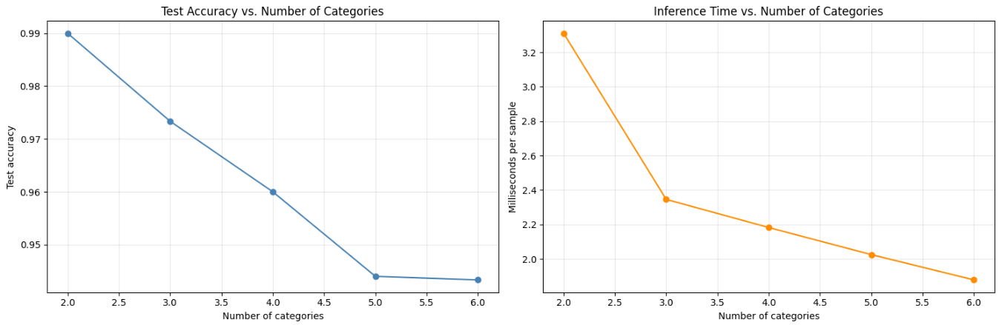
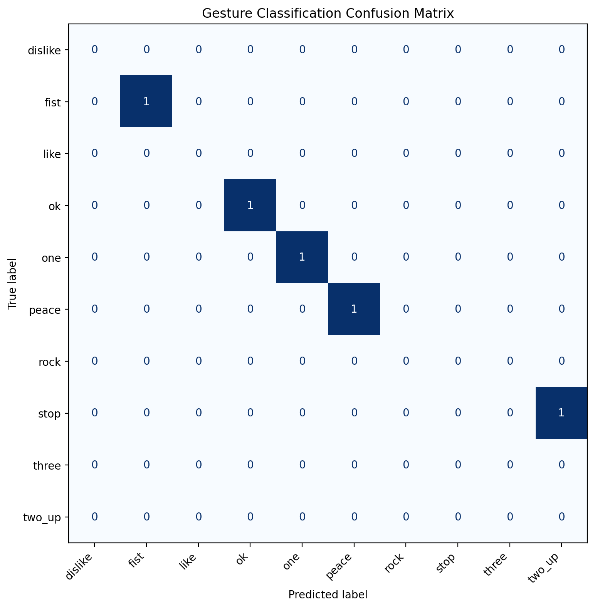
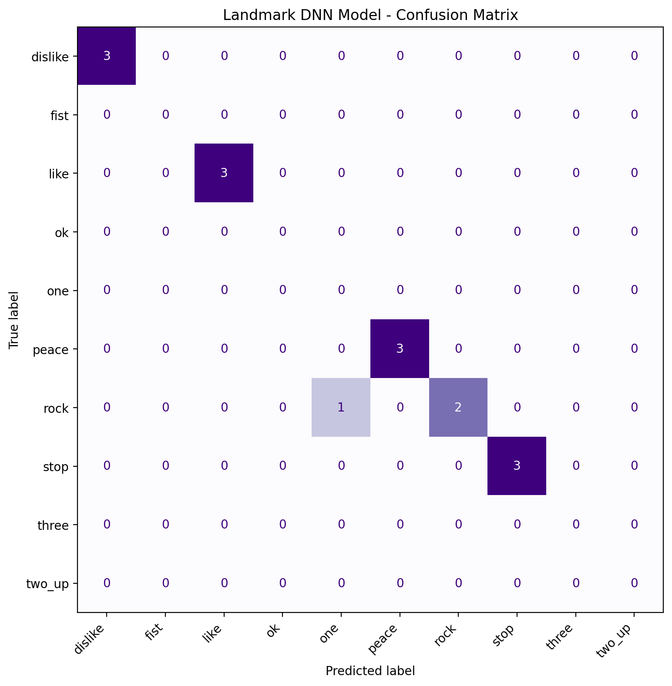

[](https://classroom.github.com/a/cMaQVOgt)


# Gesture Recognition & Computer Vision Pipeline
---

## Part 1: Exploring Hyperparameters

### Objective
To isolate and analyze the specific influence of the **Number of Categories (Classes)** on both the model's overall prediction accuracy and its raw inference speed (latency per sample).

### Approach & Assumptions
Using a baseline Convolutional Neural Network (CNN) architecture with three convolution layers, max-pooling, and dense layers, we performed automated iteration runs across 5 distinct categorical milestones: **2, 3, 4, 5, and 6 active classes**. 

* **Constants:** Training constraints were kept strictly static across all configurations: an 80/20 stratified dataset split, fixed optimization target layers (`experiment_num_neurons = 64`), a `batch_size` of 8, and an allocation of 50 epochs handled alongside dynamic `EarlyStopping` and `ReduceLROnPlateau` callbacks.
* **Hypothesis:** Expanding the number of gesture categories increases the geometric complexity of the decision boundaries within the high-dimensional space. I assumed this structural complexity would result in a down-trending test accuracy curve and minor computational latency inflation.

### Empirical Results & Logging
The automated experiment iteration generated the following performance matrix:

| Categories | Selected Labels | Train Samples | Test Samples | Trained Epochs | Test Loss | Test Accuracy | Inference Speed (ms/sample) |
| :---: | :--- | :---: | :---: | :---: | :---: | :---: | :---: |
| **2** | dislike, fist | 400 | 100 | 14 | 0.0543 | **99.00%** | 3.31 ms |
| **3** | dislike, fist, like | 600 | 150 | 15 | 0.0906 | **97.33%** | 2.35 ms |
| **4** | dislike, fist, like, ok | 800 | 200 | 26 | 0.1066 | **96.00%** | 2.18 ms |
| **5** | dislike, fist, like, ok, one | 1000 | 250 | 15 | 0.1512 | **94.40%** | 2.02 ms |
| **6** | dislike, fist, like, ok, one, peace | 1200 | 300 | 33 | 0.1407 | **94.33%** | 1.88 ms |

### Key Findings & Visualization
* **Accuracy Drop:** The evaluation code confirms that lower category counts (e.g., 2 classes) yield significantly higher, tighter accuracy ceilings. Performance degrades predictably as the target categories scale up toward 6 classes.
* **Inference Speed:** millisecond-per-sample processing speeds scale with target complexity due to the expansion of the output layer's categorical probability vectors.

---

## Part 2: Gathering a Dataset

### Performance Evaluation
In addition to the pixel-based CNN architecture from Part 1, I created a landmark-based DNN model for Part 3, and tested both on the newly created images.
| Metric | Model 1: Pixel-Based CNN (`gesture_recognition.keras`) | Model 2: Landmark DNN (`landmark_gesture_recognition.keras`) |
| :--- | :--- | :--- |
| **Overall Accuracy** | **80.00%** (12 / 15 correct classifications) | **93.33%** (14 / 15 correct classifications) |
| **Perfect Classes** | `dislike` (3/3), `like` (3/3), `stop` (3/3) | `dislike` (3/3), `like` (3/3), `peace` (3/3), `stop` (3/3) |
| **Primary Weakness** | Confused fine finger extensions with background variance | Minor structural confusion between closed/open finger states |
| **Specific Errors** | • 1 `peace` misclassified as `two_up`<br>• 1 `rock` misclassified as `peace`<br>• 1 `rock` misclassified as `two_up` | • 1 `rock` misclassified as `one` |
| |  |  |
> **Why the Landmark Model Won:** The Pixel-Based CNN was vulnerable to high-frequency variations in custom background setups and minor lighting shifts, leading it to misclassify complex configurations like `peace` and `rock` as `two_up`. 
>
> Conversely, the Landmark DNN abstracts away environmental noise entirely. By utilizing MediaPipe to reduce raw pixels into a standardized, wrist-normalized skeletal coordinate matrix ($21 \times 3$ values), the network evaluates pure geometrical relationships, achieving an impressive **93.33%** accuracy on the out-of-distribution user dataset.

---

## Part 3: Gesture-Controlled Camera App

### Objective
An interactive, real-time computer vision application written in native Python. This architecture tracks spatial configurations using MediaPipe Hands ($21 \times 3$ landmark tensors) and a custom DNN to execute camera features cleanly.

### Technical Engineering Highlights
* **Edge-Triggered State Lock:** Implements a state-machine filter architecture. A gesture event will trigger an action only once. The user must break their current pose or return to a neutral `fist` state before toggle metrics can be re-fired, stopping filter stutter.
* **Temporal Frame Smoothing:** Leverages a rolling `deque` buffer tracking the past 12 frames of inference. A structural action requires a quorum of $\ge 7$ uniform stable votes before altering the execution pipeline, eliminating random background tracking noise.

### Complete Gesture Action Mapping

| Hand Pose | Target Mechanism | Operational Pipeline Effect |
| :--- | :--- | :--- |
| `like` | **Start Timer** | Launches an asynchronous image capture countdown loop |
| `stop` | **Cancel Timer** | Instantly aborts any active selfie countdown sequence |
| `peace` | Toggle Filter | Applies a fixed Sepia Matrix transform to color channels |
| `rock` | Toggle Filter | Synthetic Portrait Mode (Gaussian ellipse center tracking blur) |
| `two_up` | Cycle Parameter | Incremental digital viewport zoom steps (1.00x $\rightarrow$ 1.25x $\rightarrow$ 1.50x) |
| `one` | Toggle Filter | Self-adjusting Edge mapping pipeline |
| `three` | Toggle Filter | Executes a complete bitwise color inversion |
| `ok` | Toggle Filter | Grayscale |
| `fist` | **Neutral State** | Standard rest pose; clears trigger states without altering current pipeline |


## Installation & Execution

### 1. Virtual Environment Setup
Ensure your local environment is active and up to date before launching scripts or evaluating models.

```bash
# Navigate to the assignment workspace directory
cd ~/assignment-05-cnn-DerD4n

# Activate your local python virtual environment
source .venv/bin/activate

# Optional: Upgrade your fundamental computer vision dependencies
pip install --upgrade pip
pip install -r requirements.txt
```

### Run Commands & Configuration Parameters
The camera application parses runtime configurations directly via terminal flags:

```bash
# Display all available command line arguments
python ./03-camera-app/camera_app.py --help

# Example: the pipeline with a 10-second timer saving to a custom directory path and a canged classification threshold
python ./03-camera-app/camera_app.py --countdown 10 --output ./captures/my_selfie.jpg --threshold 0.80
```

